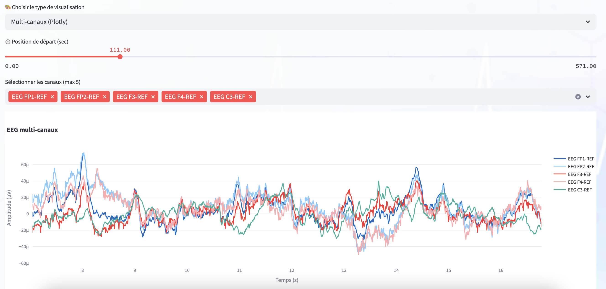
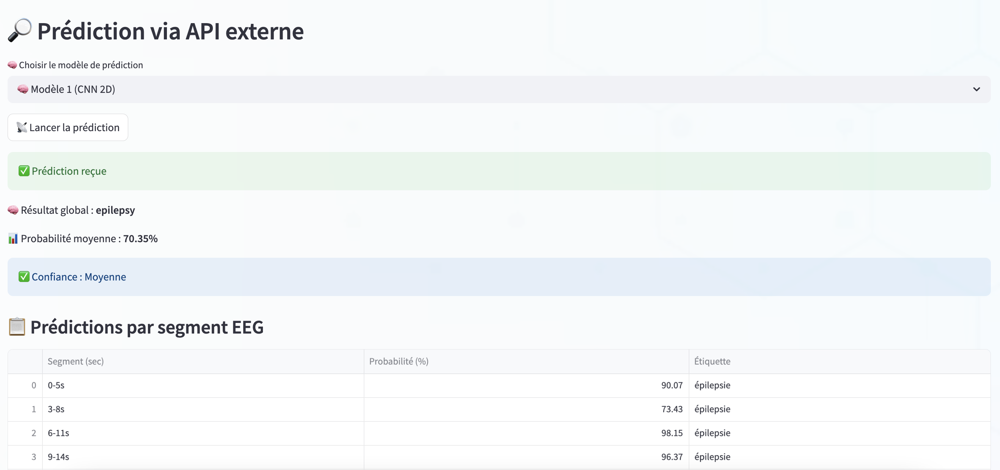
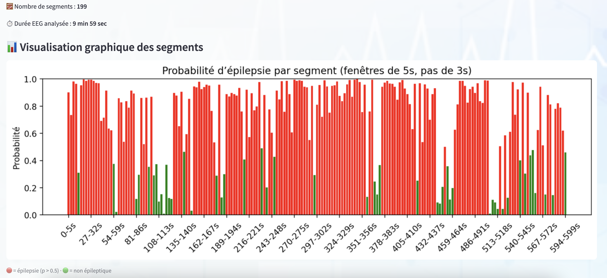

# 🧠 EEG Epilepsy Detection System

This project aims to build a robust EEG-based binary classifier to detect whether a patient has epilepsy based on signals from a single EEG session. It combines signal preprocessing, feature engineering, and deep learning to support clinical decision-making.

In addition to this analysis, we developed:
- A **Streamlit web application** for real-time EEG segment analysis, classification and model comparison.
- A **generative reporting tool** using **Google Gemini + LangChain**, which automatically produces clinician-style EEG summaries based on extracted features — offering a novel integration of LLMs with biosignal analysis.

---

## 📊 Dataset: TUH Epilepsy Corpus v2.0.1

- **Source**: [Temple University Hospital EEG Epilepsy Corpus](https://isip.piconepress.com/projects/tuh_eeg/)
- **Structure**:
  - 200 patients total (100 epileptic / 100 non-epileptic)
  - 698 EEG sessions, ~2300 EEG files
- Labels were verified by neurologists based on clinical reports
  
🔒 The raw EEG data used in this project cannot be redistributed. To replicate results, please request access via [the application form](https://isip.piconepress.com/projects/nedc/forms/tuh_eeg.pdf).

---

## 🔄 Preprocessing Pipeline

Raw `.edf` EEG signals were cleaned and segmented using the main following steps:

1. Load session from .edf (via MNE)
2. Apply bandpass filter (1–45 Hz)
3. Resample to 250 Hz
4. Select relevant EEG channels 
5. Segment into 5-second windows
6. Normalize each epoch 

Outputs are stored as pickled DataFrames and used in all downstream models. Further tailored pre-processing or feature engineering is then applied based on the model used.

---

## 🤖 Models Implemented

### Classical ML
- **Features engineering**: `features_engineering.py`
- **Feature types**:
  - Time-domain: mean, variance, skewness, kurtosis
  - Frequency-domain: relative power in delta, theta, alpha, beta, gamma bands
  - Complexity: sample entropy, permutation entropy
  - Wavelet-domain: DWT 
- **Models tested**: `Logistic Regression`, `XGBoost`
- **Pipeline**: Handcrafted features → PCA → Classification -> Stratified cross-validation (by patient)

### Deep Learning Models

- **EEGNet**
  - Shallow compact CNN architecture tailored for EEG signal classification
- **EpilepsyNet**
  - Multi-head attention architecture built over **correlation matrices** between EEG channels
- **SpectroNet (2D CNN)**
  - CNN trained on **2D STFT spectrograms** of EEG segments
---

## 📈 Performance Metrics

| Model        | Sensitivity | Specificity|
|--------------|-------------|----------|
| EEGNet       | 75%         | 88%     |
| EpilepsyNet  | 82%         | 71%     |
| SpectroNet   | 77%         | 71%     |

We present sensitivity and specificity only here due to their clinical relevance. Full metrics can be found in the notebooks and presentation.

---

## 🌐 Interactive Tools & Generative Reporting

### 📊 Real-Time Demo: Epilepsy Classifier Web App
Visualize EEG segment outputs from an `.edf` file (EEG recording session file), explore predictions, and compare models, using our interactive web app:  
👉 **[EEG Epilepsy App on Hugging Face](https://huggingface.co/spaces/MorganBrizon/EEG_Epilepsy_App)**
👉 **[Video demo](web_app/EEG_epilepsy_app_demo.mov)**

Here’s a glimpse of our real-time EEG classification app:

### 🧾 LLM-Generated EEG Reports (Experimental)  
We developed a proof-of-concept pipeline for **automated EEG report generation** using extracted signal features and Google's **Gemini 2.0 Flash API** via **LangChain**.

- Simulates clinician-style summaries based on extracted EEG characteristics
- Prompt engineering based on the American Clinical Neurophysiology Society (ACNS) Guideline for EEG reporting 
- Source notebook: [`EEG_report_Gemini.ipynb`](notebooks/EEG_report_Gemini.ipynb)

⚠️ *Note: This component is experimental and intended for research purposes only.*

---

## 🧾 Final Presentation

The summary of this work is available here:  
📎 [`Epilepsy_Classification_PPT_final.pptx`](Epilepsy_Classification_PPT_final.pptx)

---

## 👥 Team

_Jedha Data Science & Engineering Bootcamp - Final Project Team: Sonia, Robin, Morgan, Zacharie, Eli_

---

